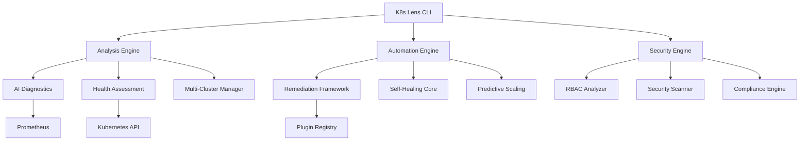

# Open Source Contribution - Kubernetes Orchestration Tool 

<table>
<tr>
<td width="200">
  
</td>
<td>
  <h3>Enterprise Ready Kubernetes Operations Platform With AI-driven Diagnostics adn Automated Remediation</h3>
  
  **Core Capabilities:**
  - 🔍 AI-Powered Cluster Analysis & Root Cause Detection
  - 🤖 Autonomous Remediation & Self-Healing Operations
  - 🛡️ Enterprise Security (RBAC, Vulnerability Scanning, Compliance)
  - 📊 Predictive Analytics & Performance Optimization
  - 🌐 Multi-Cluster Management & Unified Control Plane
  - 🔗 Prometheus, Grafana & APM Integration
</td>
</tr>
</table>

<p align="center"> 
  <a href="https://github.com/abrarahmad1510/k8s-lens/releases"></a>
  <a href="https://goreportcard.com/report/github.com/abrarahmad1510/k8s-lens"></a>
  <a href="https://opensource.org/licenses/MIT"></a>
  <a href="https://github.com/abrarahmad1510/k8s-lens/pulls"></a>
</p>

<p align="center">
  <a href="#about">About</a> •
  <a href="#key-capabilities">Key Capabilities</a> •
  <a href="#getting-started">Getting Started</a> •
  <a href="#installation">Installation</a> •
  <a href="#usage">Usage</a> •
  <a href="#enterprise-features">Enterprise Features</a> •
  <a href="#architecture">Architecture</a> •
  <a href="#contributing">Contributing</a>
</p>

---

## About

K8s Lens represents a paradigm shift in Kubernetes operations management. Designed for organizations running mission-critical workloads at scale, it delivers intelligent observability and autonomous remediation capabilities that reduce operational overhead while improving system reliability.

Traditional Kubernetes management tools excel at data collection but fall short on actionable intelligence. K8s Lens bridges this gap by leveraging advanced machine learning algorithms to analyze cluster telemetry, identify failure patterns, and automatically execute remediation strategies. The result is a self-optimizing infrastructure that maintains high availability with minimal human intervention.

Our platform serves as a force multiplier for engineering teams, enabling them to manage increasingly complex Kubernetes environments without proportional increases in headcount or operational burden. By codifying operational expertise into automated workflows, K8s Lens ensures consistent incident response, reduces MTTR (Mean Time To Resolution), and allows engineers to focus on strategic initiatives rather than reactive firefighting.

Built on extensible architecture principles, K8s Lens integrates seamlessly with existing observability stacks including Prometheus, Grafana, and enterprise APM solutions. The open-source foundation ensures transparency, auditability, and community-driven innovation, while maintaining the robustness required for production deployments across regulated industries.

---

## Key Capabilities

### 🌟 Intelligent Analysis & Diagnostics
Advanced AI models continuously analyze cluster state, resource utilization patterns, and application health metrics to provide deep insights into system behavior. Our diagnostic engine identifies root causes across complex dependency chains, significantly reducing troubleshooting time.

### 🌟 Enterprise Security & Compliance
Comprehensive security posture management including RBAC analysis, vulnerability scanning, policy enforcement, and continuous compliance monitoring against industry standards (HIPAA, SOC2, PCI-DSS). Automated audit trails ensure full traceability for regulated environments.

### 🌟 Autonomous Remediation
Self-healing capabilities that detect and resolve common failure scenarios without human intervention. Extensible plugin architecture allows organizations to codify institutional knowledge into automated remediation workflows.

### 🌟 Multi-Cluster Operations
Unified control plane for managing heterogeneous Kubernetes environments across cloud providers, on-premises data centers, and edge locations. Centralized visibility with distributed execution ensures scalability.

### 🌟 Performance Optimization
Predictive analytics drive intelligent scaling decisions and resource optimization recommendations. Machine learning models identify inefficiencies and suggest cost-saving opportunities without sacrificing performance.

### 🌟 Advanced Integrations
Native integration with Prometheus for metrics collection, support for custom dashboards, and webhook-based alert routing to existing incident management platforms. RESTful API enables custom workflows and automation.

---

## Getting Started

### System Requirements
- Kubernetes cluster v1.20 or later
- kubectl configured with appropriate cluster access
- Go 1.19+ (for source builds)
- Sufficient RBAC permissions for cluster-wide operations

### Quick Installation

```bash
# Install via Go
go install github.com/abrarahmad1510/k8s-lens/cmd/k8s-lens@latest

# Build from source
git clone https://github.com/abrarahmad1510/k8s-lens
cd k8s-lens
make build

# Verify installation
k8s-lens version
```

---

## Installation

### Binary Distribution

**Linux (amd64):**
```bash
curl -L https://github.com/abrarahmad1510/k8s-lens/releases/latest/download/k8s-lens-linux-amd64 -o k8s-lens
chmod +x k8s-lens
sudo mv k8s-lens /usr/local/bin/
```

### Container Deployment

```bash
docker run -v ~/.kube:/root/.kube \
  abrarahmad1510/k8s-lens:latest \
  analyze cluster
```

### Helm Chart Deployment

```bash
helm repo add k8s-lens https://abrarahmad1510.github.io/k8s-lens
helm repo update
helm install k8s-lens k8s-lens/k8s-lens \
  --namespace k8s-lens \
  --create-namespace
```

---

## Usage

### Cluster Analysis

```bash
# Comprehensive cluster health assessment
k8s-lens analyze cluster

# Namespace-specific analysis
k8s-lens analyze namespace production --detailed

# Resource-level inspection
k8s-lens analyze deployment web-service -n production
k8s-lens analyze pod api-server-xyz123 -n default
```

### Security Operations

```bash
# RBAC risk assessment
k8s-lens enterprise rbac analyze --namespace default

# Security vulnerability scanning
k8s-lens enterprise security scan production

# Compliance validation
k8s-lens enterprise compliance check --standard soc2
```

### Automated Remediation

```bash
# Execute remediation for specific issues
k8s-lens automation remediate pod api-pod CrashLoopBackOff -n production

# Enable autonomous mode for namespace
k8s-lens automation enable --namespace production --policy standard

# Review available remediation actions
k8s-lens automation remediate list-actions
```

### Performance Analytics

```bash
# Cluster-wide metrics analysis
k8s-lens integrations metrics cluster \
  --prometheus-url http://prometheus.monitoring.svc:9090

# Resource optimization recommendations
k8s-lens analyze optimize --namespace production

# Multi-cluster operational view
k8s-lens multicluster status --format table
```

---

## Enterprise Features

### RBAC Security Analysis

Comprehensive role-based access control assessment providing risk scoring, permission auditing, and compliance validation. Our analysis engine identifies overly permissive roles, detects privilege escalation vectors, and generates recommendations for least-privilege configurations.

**Capabilities:**
- Risk assessment scoring with actionable remediation paths
- Compliance measurement against security benchmarks (CIS, NSA/CISA)
- Automated security improvement recommendations
- Comprehensive audit reporting with change tracking

### Security Scanning

Multi-layered security validation spanning container images, runtime configurations, and network policies. Continuous vulnerability assessment with integration to industry-standard CVE databases.

**Capabilities:**
- Container image vulnerability detection and severity classification
- Network policy validation and segmentation analysis
- Secrets management audit and exposure detection
- Compliance checking for regulatory frameworks

### Autonomous Operations

Intelligent automation framework that reduces operational toil while maintaining system reliability. Extensible plugin architecture allows organizations to encode operational best practices into reusable remediation workflows.

**Supported Remediation Scenarios:**
- Pod lifecycle management (restarts, evictions, migrations)
- Resource optimization (scaling, limit adjustments)
- Network healing (endpoint regeneration, DNS updates)
- Storage operations (volume provisioning, snapshot management)

---

## Architecture

### System Design

K8s Lens employs a distributed architecture optimized for scalability and reliability. The analysis engine processes cluster telemetry through multiple specialized pipelines, while the remediation framework executes corrective actions through a plugin-based system.



### Remediation Framework

```go
// Extensible remediation interface
type Remediator interface {
    // Determines if this remediator can handle the issue
    CanFix(issueType string) bool
    
    // Executes remediation logic
    Remediate(ctx context.Context, resource, namespace string) (*RemediationResult, error)
    
    // Validates remediation success
    Verify(ctx context.Context, resource, namespace string) (bool, error)
}
```

### Technology Stack

<p align="center">
  
  
  
  
  
</p>

### Project Structure

```
k8s-lens/
├── cmd/k8s-lens/              # CLI entry points and command definitions
├── pkg/                       # Core package library
│   ├── analysis/             # Diagnostic and health assessment
│   ├── automation/           # Remediation and self-healing engine
│   ├── enterprise/           # Security and compliance features
│   ├── integrations/         # Third-party system adapters
│   └── k8s/                  # Kubernetes client utilities
├── internal/                  # Private application logic
├── api/                      # API definitions and schemas
├── config/                   # Configuration templates
├── scripts/                  # Build and deployment automation
└── tests/                    # Test suites and fixtures
```

### Build System

```bash
# Development
make build                    # Compile binary
make test                     # Run unit tests
make integration-test         # Run integration test suite
make lint                     # Code quality checks

# Release
make release                  # Multi-platform release builds
make docker-build            # Container image generation
make helm-package            # Chart packaging

# Validation
make test-security           # Security vulnerability scanning
make test-performance        # Performance benchmarks
make coverage                # Generate coverage reports
```

---

## Contributing

K8s Lens is an open-source project that benefits from community contributions. We welcome code submissions, documentation improvements, bug reports, and feature proposals from practitioners across the Kubernetes ecosystem.

### Development Environment Setup

```bash
# Clone repository
git clone https://github.com/abrarahmad1510/k8s-lens
cd k8s-lens

# Install dependencies
make deps

# Build and test
make build
make test-all
```

### Contribution Guidelines

**Code Contributions:**
1. Fork the repository and create a feature branch
2. Implement changes with appropriate test coverage
3. Ensure all tests pass and code meets quality standards
4. Submit pull request with detailed description
5. Address review feedback promptly

**Areas for Contribution:**

| Area | Description | Technical Complexity |
|------|-------------|---------------------|
| Remediation Plugins | Automated fix implementations for common failure modes | Moderate |
| Analysis Modules | Diagnostic capabilities and health checks | Moderate |
| Integration Adapters | Support for additional observability platforms | Moderate to High |
| Performance Optimization | Scalability improvements and resource efficiency | High |
| Documentation | Technical guides, tutorials, and API documentation | Low to Moderate |

### Code Quality Standards

- Comprehensive unit test coverage (>80%)
- Integration tests for critical paths
- Adherence to Go best practices and idioms
- Clear documentation for exported functions
- Semantic versioning for API changes

---

## License

This project is licensed under the MIT License, ensuring maximum flexibility for commercial and non-commercial use. See [LICENSE](LICENSE) for complete terms.

---

## Acknowledgments

K8s Lens builds upon the exceptional work of the broader Kubernetes ecosystem:

- **Cloud Native Computing Foundation** for stewarding the Kubernetes project
- **Prometheus community** for establishing observability standards
- **Go team** for providing an excellent systems programming language
- **All contributors** who invest time in improving this platform

---

<div align="center">

### K8s Lens - Intelligent Kubernetes Operations at Scale

[Report Issues](https://github.com/abrarahmad1510/k8s-lens/issues) • 
[Request Features](https://github.com/abrarahmad1510/k8s-lens/issues) • 
[Documentation](https://github.com/abrarahmad1510/k8s-lens/wiki) •
[API Reference](https://github.com/abrarahmad1510/k8s-lens/wiki/api)

</div>
